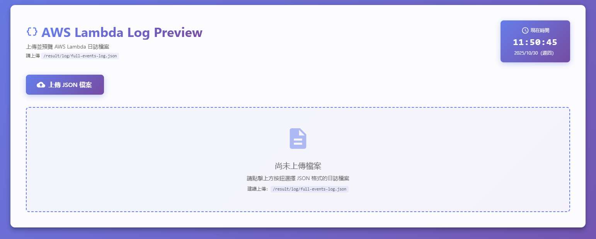
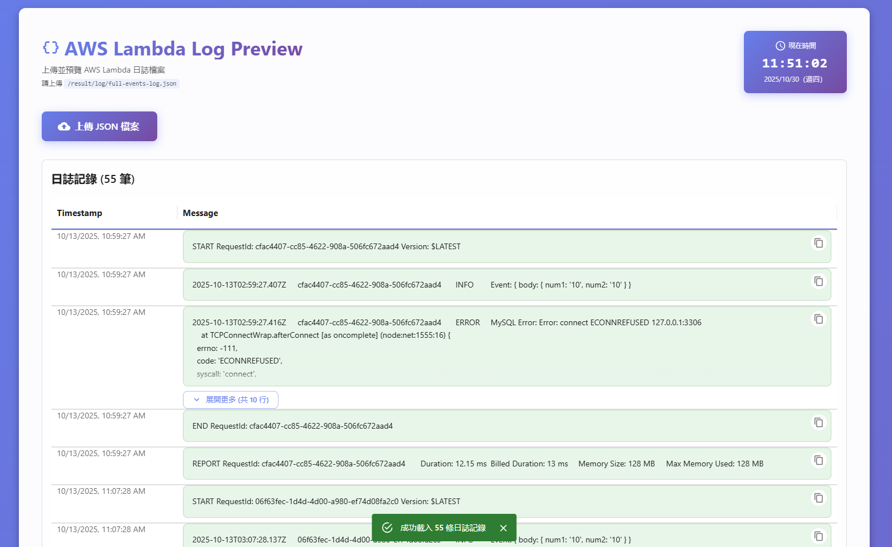

# AWS Lambda Log Previewer

**Language**: English | [繁體中文](README_ZH.md)

---

A React frontend application for previewing AWS Lambda log files.

## Features

- 📤 Manual Upload: Supports uploading JSON format log files (recommended: `/result/log/full-events-log.json`)
- 🎨 Modern UI: Elegant interface built with Material-UI
- 🔍 Detailed View: Display log events in table format with JSON detail view
- ⏰ Real-time Clock: Display current time

## Log File Format

The application expects JSON format:

```json
{
  "events": [
    {
      "eventId": "...",
      "message": "...",
      "timestamp": 1234567890
    }
  ]
}
```

## Quick Start

### Install Dependencies

```bash
npm install
```

### Start Development Server

```bash
npm start
```

The application will start at [http://localhost:3000](http://localhost:3000).

### Upload Log File

The application requires you to manually upload the log file. Click the "上傳 JSON 檔案" (Upload JSON File) button and select the log file from the following path:

```
/result/log/full-events-log.json
```

**Note**: After running `autoExec.cmd`, the `result/log/full-events-log.json` file will be generated in the main project root directory. Please select and upload that file in the application to preview logs.

#### Main Page



After uploading the log file, you can view and filter the log events in the table.

#### Upload Interface



The upload interface clearly indicates that you should upload `/result/log/full-events-log.json`.

## Build for Production

```bash
npm run build
```

After building, files will be output to the `build/` directory.

## Tech Stack

- React 19
- TypeScript
- Material-UI (MUI)
- React JSON View

## Project Structure

```
aws-lambda-log-previewer/
├── public/          # Static files
├── src/
│   ├── components/  # React components
│   │   ├── LogTable.tsx
│   │   └── Clock.tsx
│   ├── App.tsx      # Main application component
│   └── index.tsx    # Application entry point
├── image/           # Screenshots and images
│   ├── aws-lambda-page.png
│   └── aws-load-page.png
├── package.json
└── tsconfig.json
```

## Integration with Main Project

This application is designed to work with the `aws-demo` main project. After running `autoExec.cmd`, the `result/log/full-events-log.json` file will be generated. Please manually upload that file in the application to preview logs.

## License

This project is for educational and demonstration purposes only.
