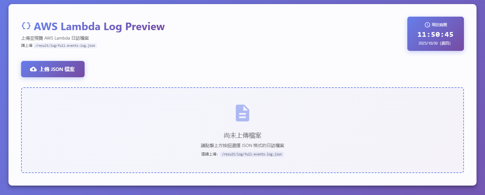
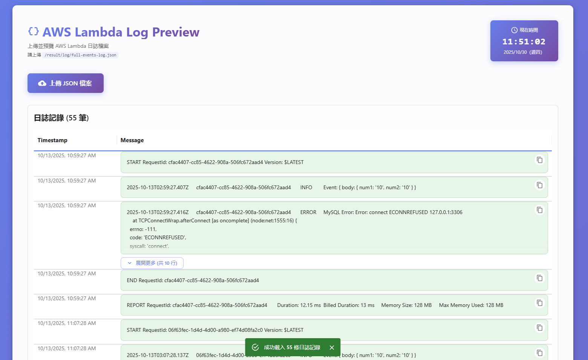

# AWS Lambda Log Previewer

**語言**: [English](README.md) | 繁體中文

---

一個用於預覽 AWS Lambda 日誌檔案的 React 前端應用程式。

## 功能特色

- 📤 手動上傳：支援上傳 JSON 格式的日誌檔案（建議使用 `/result/log/full-events-log.json`）
- 🎨 現代化 UI：使用 Material-UI 構建的優雅介面
- 🔍 詳細檢視：以表格形式展示日誌事件，支援 JSON 詳細檢視
- ⏰ 即時時鐘：顯示當前時間

## 日誌檔案格式

應用程式期望的 JSON 格式：

```json
{
  "events": [
    {
      "eventId": "...",
      "message": "...",
      "timestamp": 1234567890
    }
  ]
}
```

## 快速開始

### 安裝依賴

```bash
npm install
```

### 啟動開發伺服器

```bash
npm start
```

應用程式將在 [http://localhost:3000](http://localhost:3000) 啟動。

### 上傳日誌檔案

應用程式需要您手動上傳日誌檔案。請點擊「上傳 JSON 檔案」按鈕，選擇並上傳以下路徑的日誌檔案：

```
/result/log/full-events-log.json
```

**注意**：當您執行 `autoExec.cmd` 後，會在主專案根目錄生成 `result/log/full-events-log.json` 檔案。請在應用程式中選擇並上傳該檔案以預覽日誌。

#### 主頁面



上傳日誌檔案後，您可以在表格中檢視和篩選日誌事件。

#### 上傳介面



上傳介面明確顯示您應該上傳 `/result/log/full-events-log.json`。

## 構建生產版本

```bash
npm run build
```

構建完成後，檔案將輸出到 `build/` 目錄。

## 技術棧

- React 19
- TypeScript
- Material-UI (MUI)
- React JSON View

## 專案結構

```
aws-lambda-log-previewer/
├── public/          # 靜態檔案
├── src/
│   ├── components/  # React 元件
│   │   ├── LogTable.tsx
│   │   └── Clock.tsx
│   ├── App.tsx      # 主應用程式元件
│   └── index.tsx    # 應用程式入口
├── image/           # 截圖和圖片
│   ├── aws-lambda-page.png
│   └── aws-load-page.png
├── package.json
└── tsconfig.json
```

## 與主專案整合

此應用程式設計為與 `aws-demo` 主專案配合使用。當您執行 `autoExec.cmd` 後，會生成 `result/log/full-events-log.json` 檔案，請在應用程式中手動上傳該檔案以預覽日誌。

## 許可證

此專案僅供教育和示範用途。

